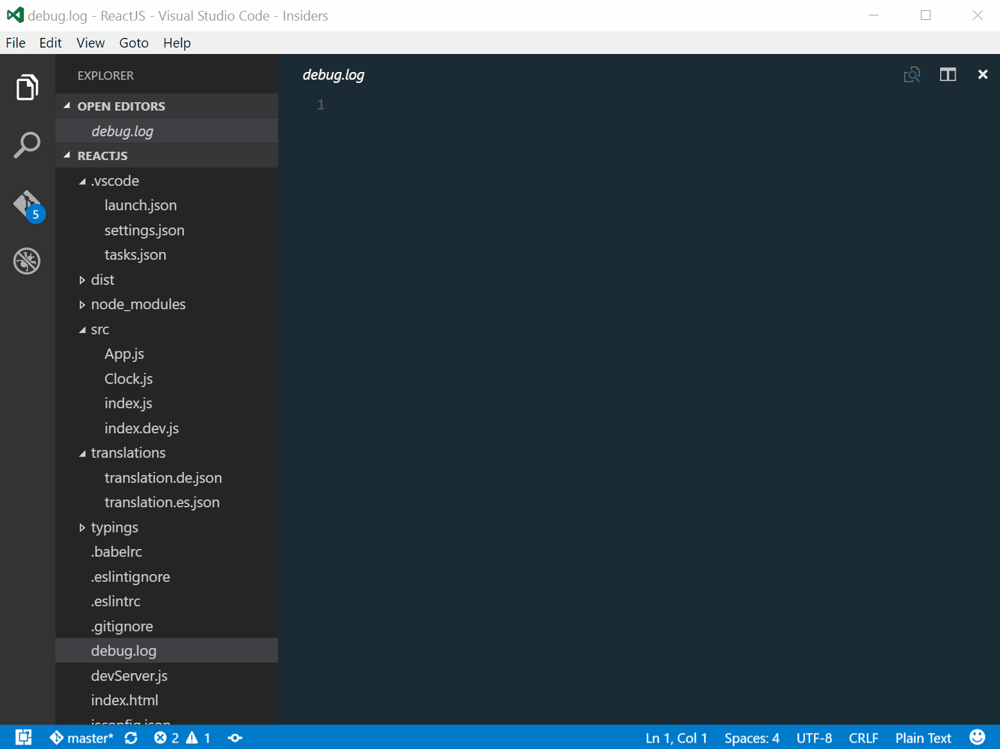

# vscode-i18n-tag-schema [](https://marketplace.visualstudio.com/items?itemName=skolmer.vscode-i18n-tag-schema) 
[](https://github.com/skolmer/es2015-i18n-tag)

This [Visual Studio Code Extension](https://marketplace.visualstudio.com/items?itemName=skolmer.vscode-i18n-tag-schema) genarates a json schema based on [i18n tagged template literals](https://github.com/skolmer/es2015-i18n-tag) in your javascript project

For more details please see: https://github.com/skolmer/es2015-i18n-tag

[](https://marketplace.visualstudio.com/items?itemName=skolmer.vscode-i18n-tag-schema)

##.vscode/settings.json
For quick configuration use `i18nTag: Configure translation schema generator` command

```json
    "i18nTag.src": "./src",
	"i18nTag.schema": "./translation.schema.json",
	"i18nTag.filter": "\\.jsx?",
    "i18nTag.grouped": false
    "json.schemas": [
        {
            "fileMatch": [
                "/src/i18n/*.json"
            ],
            "url": "./translation.schema.json"
        }
    ]
```
   
## Use
* Run command `i18nTag: Update translation schema` to generate a new translation schema.
* Run command `i18nTag: Show translation schema` to show the current translation schema.
* Run command `i18nTag: Show last local change to translation schema` to show the last local change of translation schema.

## Reference schema in individual JSON file
If you don't set the translation directory in configuration you can reference the schema directly in your json file.
```json
{
    "$schema": "./translation.schema.json",
    "key": "value"
}
```

## Tools

### Run time translation and localization
* [es2015-i18n-tag](https://github.com/skolmer/es2015-i18n-tag): ES2015 template literal tag for i18n and l10n translation and localization using Intl

### Build time translation
* [babel-plugin-i18n-tag-translate](https://github.com/skolmer/babel-plugin-i18n-tag-translate): Translate your template literals at build time.

### Schema based translations
* [i18n-tag-schema](https://github.com/skolmer/i18n-tag-schema): Generates a JSON schema based on all i18n tagged literals in your project.
